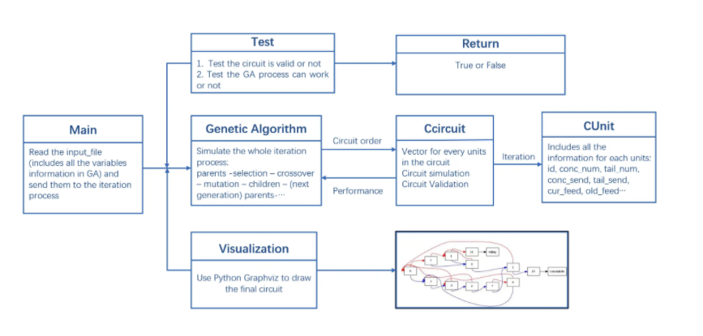

# Optimal mineral recovery using Genetic Algorithms
**ACSE-4: Group Project 2**

Team Member: 

Yikai Qian, Zhaojian Liao, Tong Zheng, Zinan Liao, Ran Tao, Xuyuan Chen, Shining Zhou, Yuyu Su, Jingyi Hu 

## About this project

This project implements a Genetic Algorithms to determine the optimum circuit configuration and performance for a circuit that contains given units. The project consists of four main components: genetic algorithm implementation, the mass balance solver, the circuit validity checking and the post-processing.


## Set up & Run

This project presets 5 units, 10 units and 15 units as experimental examples. The parameter settings of these experiments can be adjusted through the corresponding files in the input_file folder. Therefore, in order to read the config file correctly, you need to ensure that your executable file is in the home folder. 

- Under Linux and Windows, run the makefile first to generate a executable file. Then run the executable file.
- Windows-based operating system or MacOS. A specific IDE such as Visual Studio can also be chosen to run the project. 
- The Visualization folder contains the drawing tools for generating circuit and the environment configuration file.

Please note that this project uses the argv[1] parameter as the criterion for judging whether to output the log file. The user can obtain the output file by assigning this parameter to 1 or any other value to run the version of the unexported file.


The following shows a locally run method based on Windows:

```bash
$ git clone https://github.com/acse-2020/acse-4-gormanium-rush-sphalerite.git
$ cd acse-4-gormanium-rush-sphalerite
$ g++ src/main.cpp -o main -std=c++11 -I ./includes
$ ./main.exe 0  # this argument can be replaced to 1 if user want to save the results
```


## Code Structure
### main.cpp:
The main function that runs by default will automatically read the three csv files in the input_file folder and generate the optimal connection and the highest performance result and save the results (if the user needs).

### Genetic_Algorithm.cpp:
Contains all the methods needed to implement the genetic algorithm and simulates the entire iterative process.

### CCircuit.cpp:
Used to simulate the entire circuit and save the attributes of each unit. It includes **Evaluate()**, **Check_Validity()**, **Mark_Units()** methods respectively for iterative calculation of the performance of a circuit and checking the validity of the circuit

### General view:
<p align="center">
  
</p>

## Documentation

The documentation available as of the date of this release is included in HTML format in the doc/html/index.html


## Installation

C++

Python

## Input
Users can adjust the parameters in the input csv file without the need to adjust the parameters through the code to conduct experiments and conduct comparative analysis.
<p align="center">
  
</p>

## Output

The output log image example, the file name is the time when the output file.
<p align="center">
  
</p>

Schematic diagram of the optimal loop generated after successfully running the genetic algorithm.
<p align="center">
  
</p>

Through adjustment of parameters and analysis of experimental results after multiple trials.
<p align="center">
  
</p>

When the user uses the terminal to run the output, the user can clearly see the changes in the results of each of the three control experiments and the final time.
<p align="center">
  
</p>

## Licensing

This project is licensed under the MIT License. Please see the file called LICENSE.

## PowerPoint for pre
The powerpoint names "acse4-2_pre_ppt.pptx". Our presentation vedio can be seen : https://web.microsoftstream.com/group/9b7d1ee4-57a6-409a-8f71-70f56bb350ce


